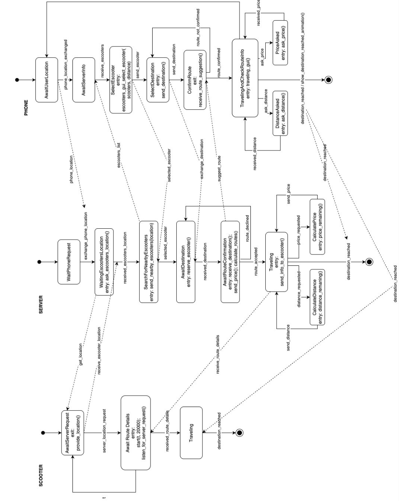

# TDT_4115_States_Machines Team 02
For this final delivery, here's the implementation of
the improved states machines described in the second
delivery.

This states machines are:
* The Phone: it should run on a phone or lapton with a
screen, since it has a grafical interface to send the 
messages
* The server: Mean to be run on one of the raspberrypi
or a similar context. It will handle the comunication
with the phone and is responsible to contact with the 
escooters.
* The Escooters: This script is also supposed to run 
on a raspberrypi, it will be the software of the escooters
and its main job is to send the location to the server when
requested and to receive and check the route details in order
to make sure that the user doesnt go off route (the comunication 
was implemented, but the out_route_exception wasn't due to our lack
of time and ability to simulate locations)

### How to run
First clone the github repository, create a virtual environment
for this project with ``python3 -m venv -venv``
and activate it with ``source .venv/bin/activate``, note that the
command to activate it would be different deppending on the operating system

Once that is set, install the requirements thorough:
``pip install -r requirements.txt``, 
* If an error of stmpy not found shows up:
``pip install stmpy``
* If an error of paho not found shows up:
``pip install --upgrade paho-mqtt``

